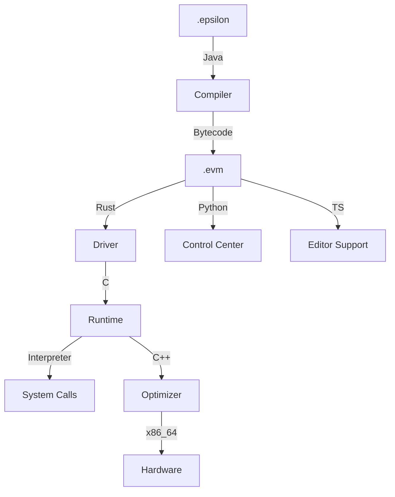

# EpsilonVM Architecture Guide

EpsilonVM is a high-performance polyglot virtual machine ecosystem. This document outlines the technical flow from source code to native machine execution.

## System Overview

## Component Breakdown

### 1. Frontend (Java)
- **Parser**: Recursive descent parser building an AST.
- **Optimizations**: implements **Constant Folding** to evaluate literal expressions at compile-time.
- **Bytecode**: Emits a custom register-based binary format.

### 2. VM Core (C)
- **Garbage Collection**: **Mark-Sweep** collector with safe root tracking from registers.
- **Runtime**: High-efficiency loop handling register-based opcodes.
- **Safety**: Robust bounds checking on constant pools and register files.

### 3. JIT Compiler (C++)
- **Optimization**: Hot-path detection that translates frequently executed bytecode to native x86_64 instructions using direct machine code emission.
- **Memory**: Secure executable page allocation using `mmap` (POSIX) or `VirtualAlloc` (Windows).

### 4. CLI Driver (Rust)
- **Orchestration**: Built with `clap` and `colored`, providing a seamless developer experience.
- **Build System**: Integrates with the root `Makefile` to manage multi-language dependencies.

### 5. Observability (Python/TS)
- **Visualizer**: Tkinter-based production dashboard for real-time inspection of AST, Bytecode, and VM state.
- **LSP**: Standardized Language Server Protocol implementation for VSCode/NeoVim.
