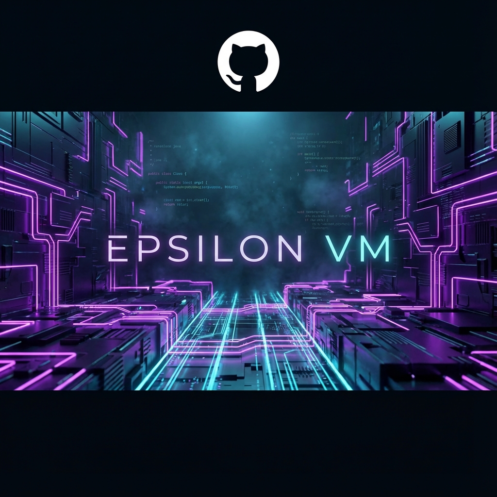
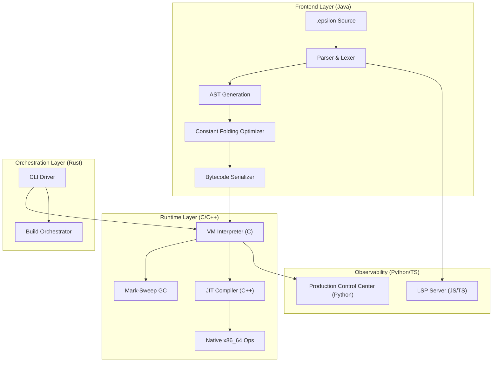
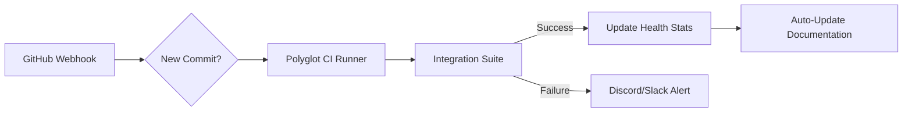

# 🌌 EpsilonVM: The Polyglot Compiler Ecosystem



[](https://opensource.org/licenses/MIT)
[](#)
[](#)
[](#)

**EpsilonVM** is a production-hardened, high-performance virtual machine and compiler ecosystem built using a coordinated polyglot architecture. It demonstrates the seamless integration of **Java, C, C++, Rust, Python, and TypeScript** to solve complex problems in language design, memory management, and runtime optimization.

---

## 🏗️ System Architecture

EpsilonVM follows a decoupled "Source-to-Native" pipeline. Each component is chosen for its specific strengths in the compiler stack.



---

## ⚡ Key Features

- **🚀 Hybrid Execution Engine**: Combines a high-efficiency C interpreter with a C++ JIT compiler for hot-path native execution.
- **🧹 Mark-Sweep Garbage Collection**: Robust, VM-aware memory management with register-based root tracking.
- **💎 Constant Folding**: Advanced frontend optimization pass that pre-evaluates expressions at compile-time.
- **🛠️ Professional Tooling**: 
  - **Rust CLI**: A premium terminal interface built with `clap` and `colored`.
  - **Visualizer**: A Tkinter-based dark-themed dashboard for real-time VM inspection.
  - **LSP Support**: Full IDE integration with precise line/column diagnostics.

---

## 🤖 n8n Automation Workflow

We leverage **n8n** to automate the complex multi-language CI/CD pipeline and ecosystem health monitoring.



**Workflow Highlights:**
- **Polyglot CI**: Automatically spans environments for Java, Rust, and C/C++.
- **Regression Guard**: Runs stress tests (e.g., `gc_stress.epsilon`) on every PR.
- **Performance Benchmarking**: Captures JIT vs. Interpreter metrics and posts them to the team dashboard.

---

## 📂 Folder Structure

```text
EpsilonVM/
├── assets/             # Branding and AI-generated imagery
├── cli/                # Rust-based CLI Driver (Command & Control)
├── frontend/           # Java-based Compiler (Lexer, Parser, Optimizer)
├── vm/                 # Core C Runtime (Interpreter, GC, Memory)
├── jit/                # C++ JIT Engine (Native Code Generation)
├── lsp/                # JavaScript/TS Language Server
├── viz/                # Python-based Production Control Center
├── examples/           # Stress tests and recursive algorithms
├── Makefile            # Root build orchestrator
└── ARCH.md             # Deep-dive technical documentation
```

---

## 🛠️ Quick Start

### 1. Unified Build
Build the entire ecosystem with a single command:
```bash
make all
```

### 2. Launch the Control Center
Visualize the VM state and compile-time optimizations:
```bash
python viz/viz.py
```

### 3. Run a Script
Execute one of the production examples:
```bash
./cli/target/release/epsilon run examples/recursive_fib.epsilon
```

---

## 🧠 Design Philosophy
EpsilonVM is designed for **Modularity without Performance Compromise**. By utilizing the safety of Rust for the driver, the ubiquity of Java for the frontend, and the raw power of C/C++ for the runtime, it achieves a "best-of-all-worlds" architecture.

---
*Maintained by the Epsilon Core Team*
